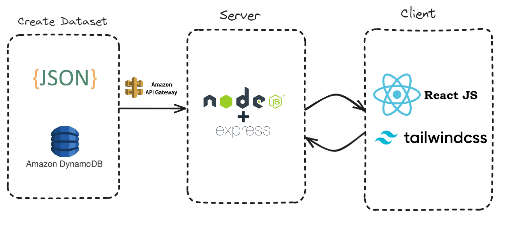
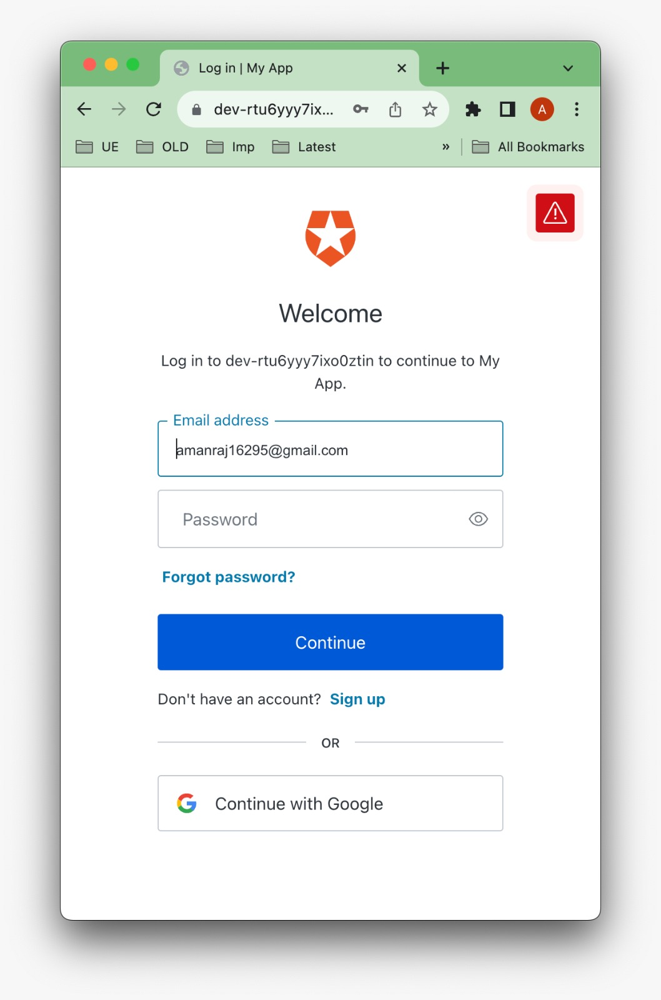
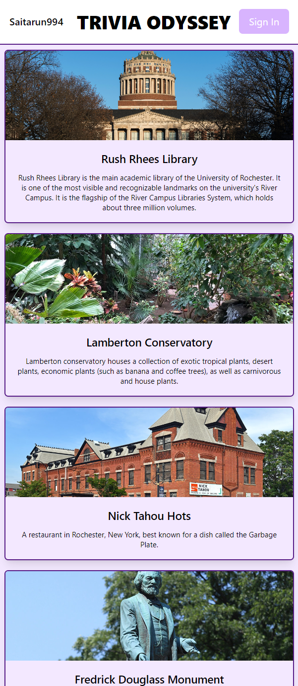
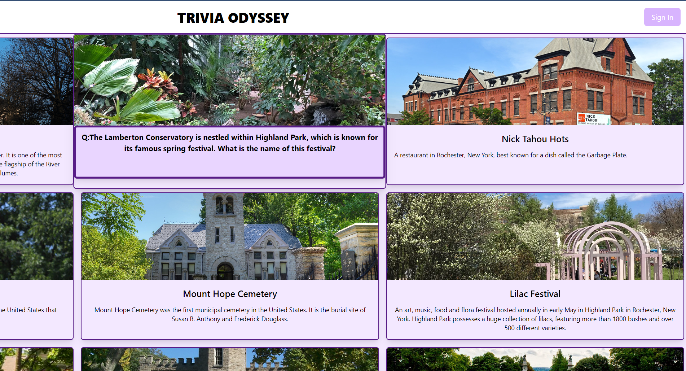

<h1 align="center">

</h1> 

# Trivia Odyssey
Uses geolocation to track nearest landmarks and famous tourist locations around you and shows ordered tile view of things you can do. A simple and fun location based landmark/tourist attraction identificaiton app, which adds fun little trivia quiz to this location, so you learn and explore at the same time.

<h1 align="center">

</h1> 

## 🔑 Key Feature

### Auth0 Login to save favourite locations

### Simple Tile view of nearest landmarks

### Works on mobile devices as well

### Hover over the tile to get interesting trivia

### If you want to go there, just click the card to get directions: 

## 🛠 Skills
Cyclic hosting, amazon-dynamodb, auth0, cyclic, express.js , node.js, React

## 📃 Challenges we ran into
- Fitting all aspects of a fullstack app into play
- Finding a good use for user authentication
- Setting up express api and cyclic hosting took most of our time
- Fleshing out the trivia section with more questions

## Accomplishments that we're proud of
**Everyone of our team members worked on technologies we've never used before, Learnt new things at a rapid pace**
- Created a dataset of tourist attractions and landmarks around rochester (our current location)
- Track the users current live location and show a list of cards containing tourist attractions around them
- Clicking on that tourist attraction allows the user to get the direction to that place and a fun trivia question, which lets them learn something new about it.
- Powered by Auth0 to enable user login and logout

  
## What we learned
DynamoDB, Hosting on Cyclic,  Express Api calls, React/tailwindcss , node.js, Auth0 api

## What's next for Trivia Odyssey
- Creating databases for more locations by contacting local guides
- Scaling the trivia side of things
- Travel planning by introducing bookmarks feature
